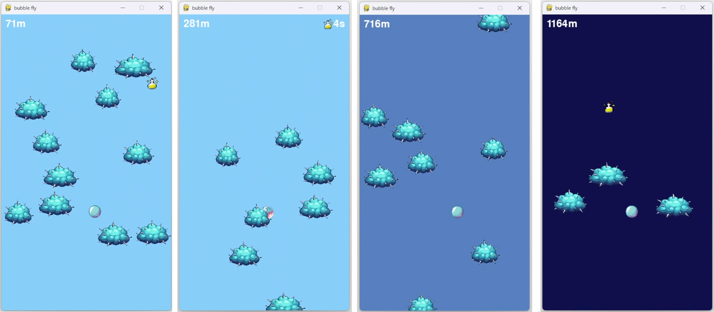

<div align="center">

# Flying Bubble



</div>

**Flying Bubble** é um jogo de ação onde o jogador controla uma bolha que deve desviar de obstáculos enquanto sobe pelo cenário. Com gráficos coloridos e animações simples, o jogo oferece desafios crescentes, incluindo booster de imunidade temporário e a necessidade de habilidades rápidas para evitar colisões. Mantenha-se no ar o maior tempo possível e veja até onde você consegue chegar!

## Contexto

Este jogo foi criado em menos de 24 horas durante minha participação na Global Game Jam, realizada na PUC-PR em 2025. Foi um grande desafio, pois nunca tinha feito um jogo antes e também nunca havia utilizado o Pygame. Apesar disso, consegui desenvolver um projeto funcional e divertido, mesmo sendo simples. Estou muito orgulhosa do resultado e da experiência adquirida.

Confira os links relacionados ao projeto:
- [Página do jogo na Global Game Jam](https://globalgamejam.org/games/2025/bubble-clicker-2)
- [Vídeo do gameplay no YouTube](https://youtu.be/mI_7kAe7HvM)

## Características

- Controle lateral da bolha.
- Obstáculos que descem pela tela em velocidade crescente.
- Boosters de imunidade que fornecem proteção temporária.
- Transição de cores no cenário conforme você sobe.
- Música de fundo e efeitos sonoros imersivos.
- Tela de Game Over com opção de reiniciar o jogo.

## Controles

- **Seta Esquerda (←)**: Move a bolha para a esquerda.
- **Seta Direita (→)**: Move a bolha para a direita.
- **Espaço**: Começa ou reinicia o jogo.

## Requisitos

- Python 3.10 ou superior.
- Biblioteca Pygame instalada (versão 2.0 ou superior).

## Setup Local

1. Clone ou baixe o repositório do jogo:
   ```bash
   git clone https://github.com/CarolineSampaio/flying-bubble-global-game-jam
   cd flying-bubble-global-game-jam
   ```

2. Certifique-se de ter o Python 3.10 ou superior instalado. Você pode verificar a versão instalada com:
   ```bash
   python --version
   ```

3. Instale as dependências necessárias usando o gerenciador de pacotes `pip`:
   ```bash
   pip install pygame
   ```

4. Certifique-se de que a estrutura do diretório do jogo está correta:
   ```
   flying-bubble-global-game-jam/
   |— gallery/
   |   |— sprites/
   |   |   |— bubble.png
   |   |   |— bubble_burst.png
   |   |   |— bubble_immunity.png
   |   |   |— obstacle.png
   |   |   |— immunity.png
   |   |— audio/
   |       |— flying.mp3
   |       |— die.mp3
   |— .gitignore
   |— README.md
   |— bubble.py
   |— setup.py
   ```

## Como Jogar

Existem duas formas de jogar o jogo: diretamente no código-fonte ou por meio de um executável.

### Jogando Localmente (Código-Fonte)

1. Navegue até a pasta do jogo:
   ```bash
   cd flying-bubble-global-game-jam
   ```

2. Execute o arquivo principal do jogo:
   ```bash
   python bubble.py
   ```

3. Na tela inicial, pressione **Espaço** para começar a jogar:
   - Use as **setas do teclado** para mover a bolha para a esquerda ou direita.
   - Evite os obstáculos e colete bolinhas de imunidade para ganhar proteção temporária.

4. Se o jogo terminar, pressione **Espaço** para reiniciar.

### Criando Executável e Instalador

Se você deseja criar uma versão executável ou um instalador do jogo para facilitar a distribuição:

1. Instale as dependências adicionais necessárias:
   ```bash
   pip install cx_Freeze pygame
   ```

2. Gere o executável do jogo:
   ```bash
   python setup.py build
   ```
   Isso criará uma pasta `build/` contendo o executável do jogo.

3. Para criar um instalador (.msi), execute:
   ```bash
   python setup.py bdist_msi
   ```
   Isso criará um arquivo instalador na pasta `dist/`.

## Observações Importantes

- Certifique-se de que o projeto foi clonado corretamente e que todo os arquivos necessários para o jogo (imagens e sons) estejam incluídos corretamente nas pastas `gallery/sprites/` e `gallery/audio/`.
  
- O executável gerado com o `cx_Freeze` depende do ambiente Python instalado no computador onde o jogo será executado. Isso significa que, para que o executável funcione em outro computador, o jogador precisará ter o Python 3.10 ou superior instalado no sistema.

## Melhorias Futuras

- Adicionar power-ups com diferentes efeitos.
- Implementar tabelas de recordes locais ou globais.
- Variar o design dos obstáculos.
- Tornar o jogo responsivo para diferentes resoluções de tela.

## Licença

Este jogo foi desenvolvido como parte de um projeto pessoal. Fique à vontade para usá-lo, modificá-lo e compartilhá-lo.